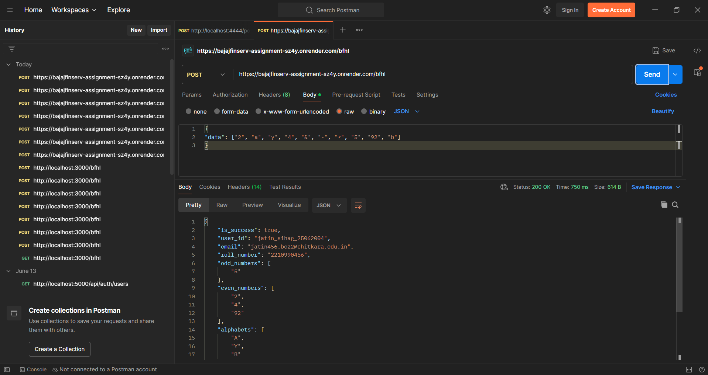

BFHL API - Data Transformation Service

Author : Jatin Sihag 

This is a simple Node.js REST API designed to process and categorize various data types as part of the BFHL (Backend Frontend Handling Logic) challenge. It handles numbers, alphabets, and special characters, performing specific transformations and calculations.

How to Run Locally
To get this API up and running on your local machine, follow these steps:

Install Dependencies:
Open your terminal or command prompt, navigate to the project directory, and run the following command to install all necessary Node.js packages:

npm install

Start the Server:
Once the dependencies are installed, you can start the API server by executing:

npm start

The server will typically start on port 3000. You'll see a message in your console indicating that the server is running successfully, along with the URL to access it.

Access the API:
The API endpoint for processing data will be available at:
http://localhost:3000/bfhl

Example API Usage
This API accepts POST requests to the /bfhl endpoint with a JSON body containing a data array.

Example Request
Here's an example of a request body you can send to the API.
Notice how various data types (alphabets, numbers, and special characters) are included in the data array.

{
  "data": ["a","1","334","4","R", "$"]
}

Postman Screenshot of Example Request:

Example Response
Upon successfully processing the request, the API will return a JSON object categorizing the input, providing personal identification details, and displaying transformed data.

{
  "is_success": true,
  "user_id": "jatin_sihag_25062004",
  "email": "jatin456.be22@chitkara.edu.in",
  "roll_number": "2210990456",
  "odd_numbers": ["1"],
  "even_numbers": ["334","4"],
  "alphabets": ["A","R"],
  "special_characters": ["$"],
  "sum": "339",
  "concat_string": "Ra"
}

Example Request 2
This example demonstrates another set of mixed data types including numbers, alphabets, and special characters.

{
  "data": ["2", "a", "y", "4", "&", "-", "*", "5", "92", "b"]
}

JSON

{
  "is_success": true,
  "user_id": "jatin_sihag_25062004",
  "email": "jatin456.be22@chitkara.edu.in",
  "roll_number": "2210990456",
  "odd_numbers": ["5"],
  "even_numbers": ["2", "4", "92"],
  "alphabets": ["A", "Y", "B"],
  "special_characters": ["&", "-", "*"],
  "sum": "103",
  "concat_string": "YBA"
}
Postman Screenshot of Example Response:

Deployment link :
https://bajajfinserv-assignment-sz4y.onrender.com

